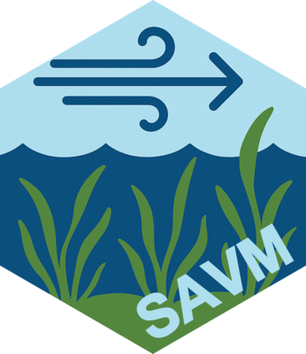

# SAVM 
[](https://github.com/inSilecoInc/SAVM/actions/workflows/R-CMD-check.yaml)


## Background

Fisheries and Oceans Canada (DFO) is responsible for the management of aquatic freshwater habitat and the Fish and Fish Habitat Protection Program is seeking tools that can help in their decision support process. The Fish Ecology Science Lab at DFO has developed general models to predict the presence and cover of submerged aquatic vegetation (SAV) in the Laurentian Great Lakes (Croft-White et al. 2022). SAV is a critical component of fish habitat that is frequently affected by in-water works or habitat improvement initiatives. Croft-White et al. (2022) outlines the completed SAV model and how an  R-package and  web-application tool could be created and utilized. DFO GLLFAS does not have the capacity to create the necessary R package and requires the services of a contractor to advance these works. A key aspect of package development will be ensuring further tool development within DFO can follow similar methods so tools can be integrated or, at a minimum, contain input or outputs that can be moved among tools.


## Installation

You can install SAVM from GitHub using the `pak` package:

```r
# Install pak if you don't have it
install.packages("pak")

# Install SAVM
pak::pak("FishEcologyScience/SAVM")
```

Alternatively, you can use `remotes`:

```r
# Install remotes if you don't have it
install.packages("remotes")

# Install SAVM
remotes::install_github("FishEcologyScience/SAVM")
```

### System Requirements

- R >= 4.2
- Quarto (required for rendering vignettes and documentation)
- Geospatial system libraries required for the `sf` package (GDAL, GEOS, PROJ)

#### Installing Quarto

Download and install Quarto from [https://quarto.org/docs/get-started/](https://quarto.org/docs/get-started/), or using package managers:

On Ubuntu/Debian:
```bash
sudo apt-get install quarto
```

On macOS (using Homebrew):
```bash
brew install quarto
```

#### Installing Geospatial Libraries

On Ubuntu/Debian:
```bash
sudo apt-get install libgdal-dev libgeos-dev libproj-dev libudunits2-dev
```

On macOS (using Homebrew):
```bash
brew install gdal geos proj udunits
```

On Windows, these dependencies are typically handled automatically during package installation.


## Code Organization

### Package Structure

SAVM is a hybrid R package that provides both programmatic functions and a comprehensive Shiny web application. The package implements statistical models for predicting submerged aquatic vegetation presence and cover in the Laurentian Great Lakes.

### Directory Overview

- **R/** - Core source code (20 files, ~6,000 lines)
  - Application architecture (`app_*.R`)
  - Shiny modules (`mod_*.R`)
  - Data processing functions (`read.R`, `compute_fetch.R`, `model.R`)
  - Visualization (`plot_sav.R`)
  - Utilities (`utils_*.R`, `zzz.R`)

- **inst/** - Package resources
  - `extdata/models/` - 6 pre-trained models (Random Forest, GAM, LMM)
  - `extdata/polygons/` - Great Lakes boundary files (GeoPackage format)
  - `extdata/templates/` - CSV templates for user input
  - `app/www/` - Shiny app assets (CSS, images, HTML documentation)
  - `example/` - Example datasets (Lake Erie, Lake Ontario)

- **tests/** - Test suite using testthat framework
  - Unit tests for core functions
  - Visual regression tests for plots
  - Snapshot testing for consistent outputs

- **vignettes/** - User documentation
  - `get_started.Rmd` - Workflow introduction
  - `models.Rmd` - Model methodology

- **man/** - Function documentation (auto-generated)

### Key Modules

The Shiny application follows a step-by-step workflow with dedicated modules:

1. **mod_data_input.R** (856 lines) - Upload and validate CSV/spatial data
2. **mod_fetch_calc.R** (542 lines) - Wind fetch calculation interface
3. **mod_depth_extract.R** (337 lines) - Bathymetric depth extraction
4. **mod_model_apply.R** (672 lines) - Model configuration and prediction
5. **mod_results_viz.R** (994 lines) - Results visualization and export
6. **mod_input_tab.R** (183 lines) - Data assembly overview
7. **mod_modal_welcome.R** (27 lines) - Welcome dialog

### Core Functions

**Data Input:**
- `read_sav()` - Main wrapper for reading data
- `read_sav_csv()` - Read point data from CSV
- `read_sav_pts()` - Read spatial point data
- `read_sav_aoi()` - Read polygons and generate grids

**Processing:**
- `compute_fetch()` - Calculate wind fetch for points
- `sav_model()` - Apply SAV prediction models
- `sav_load_model()` - Load pre-trained models

**Visualization:**
- `plot_sav_distribution()` - Distribution plots
- `plot_sav_density()` - Density visualizations
- `plot_sav_tmap()` - Interactive maps

**Application:**
- `run_app()` - Launch Shiny application


### Pre-trained Models

Six statistical models available in `inst/extdata/models/`:

**Presence/Absence:** `rf_pa.rds`, `gam_pa.rds`, `lmm_pa.rds`
**Cover Prediction:** `rf_cover.rds`, `gam_cover.rds`, `lmm_cover.rds`

All models use depth (m) and fetch (km) as primary predictors.


### Key references  

* Croft-White, M.V., Tang, R., Gardner Costa, J., Doka, S.E., and Midwood, J.
D. 2022. Modelling submerged aquatic vegetation presence and percent cover
to support the development of a freshwater fish habitat management tool.
Can. Tech. Rep. Fish. Aquat. Sci. 3497: vi + 30 p.

* Chambers, P.A., and Kalff, J. 1985. Depth Distribution and Biomass of
Submerged aquatic macrophyte communities in relation to secchi depth.
Can. J. Fish. Aquat. Sci. 42: 701–709


## Code of Conduct

Please note that this project is released with a [Contributor Code of Conduct](https://docs.ropensci.org/rcites/CONDUCT.html).
By participating in this project you agree to abide by its terms.